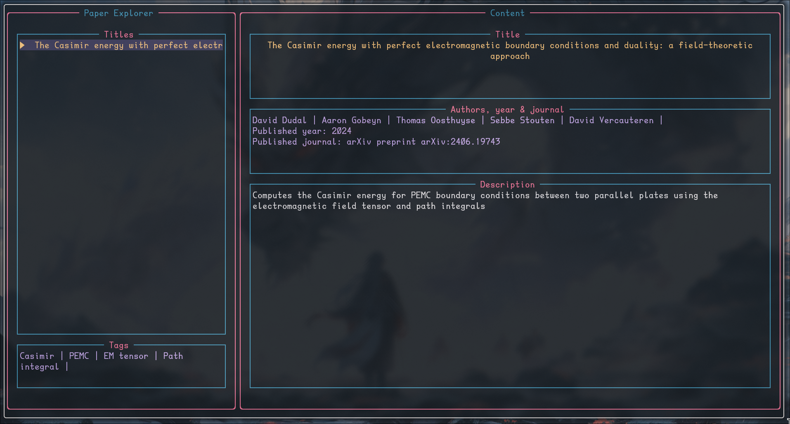

# Dumpling



Dumpling is a light-weight, minimal research paper manager from the terminal. With the CLI tool, basic information on research papers 
can be created, and subsequently be explored by the TUI. Inside the TUI a minimal amount of essential actions can be performed. 

By default, the application assumes papers are stored in `$HOME/.paper/`. The paper information files created by the CLI tool are stored in the 
`$HOME/.cache/dumpling` directory which is always generated if it does not exists when the program is executed. 

The program should work on UNIX based systems, e.g. Linux and MacOS, we are not sure if it does on Windows.

## Installation

For easy installation, a `Makefile` is provided. It is assumed that `GNU Make` and `Rust` are installed on you system. To build the application run:
```
$ make
```
To copy the resulting compiled application to the /usr/bin/ directory so it can be accessed globally in you system run:
```
$ make install
```
Copying the file to that directory is not required, you could also `export` the path to the binary in your `.bashrc`, `.zshrc`, etc.
Lastly, to clean files from the compilation process:
```
$ make clean
```

## Usage 

Dumpling provides a single CLI tool called `dumpling`. The following 
arguments can be attached to it:

| Short form | Long form | Argument | Action |
|------------|-----------|----------|--------|
| -t | --title | "\[TITLE\]" | Set title of paper |
| -y | --year | INT | Set year of publication |
| -j | --journal | "\[JOURNAL\]" | Set journal the paper was published in |
| / | --desc | "\[DESCRIPTION\]" | Short description of the papers contents |
| -b | --bibtex | "\[BIB\]" | Bibtex formatted reference for the paper |
| / | --doc | "\[DOCNAME\]" | Name of the PDF document, the directory is set in the configuration file and should not be provided |
| / | --filter-tag | "\[TAG\]" |Show only papers with certain tag. This only does something if the TUI is opened.|
| -a | --author | "\[AUTHOR\]" | Add author for the paper, this option can be used multiple times. |
| / | --tag | "\[TAG\]" | Add tag to paper, this option can be used multiple times. |
| -o | --open | No argument | Open the TUI. |
| / | --list-tags | No argument | List all the tags used and how often they appear. |
| / | --pdf-diagnose | No argument | Show all the PDF file paths mentioned in the paper files that are invalid, i.e. the file it points to does not exists. Also show all the PDF files in the `pdf_dir` that are not mentioned by any paper file | 
| / | --auto | No argument | If `--bibtex` is provided, the contents of it are used to automatically infer `--title`, `--year`, `--journal` and all the `--authors`. The result can be overwritten by using those flags anyway. | 
| -h | --help | No argument | Print the help menu. |
| / | --version | No argument | Print package information |

Here is an example usage:
```
$ dumpling -t "The Casimir Energy with Perfect Electromagnetic Boundary Conditions and Duality: a Field Theoretic Approach" -y 2024 -j "Preprint arXiv" --desc "Computes the Casimir energy for PEMC boundary conditions between two parallel plates using the electromagnetic field tensor and path integrals" 
-b "@article{dudal2024casimir,
  title={The Casimir energy with perfect electromagnetic boundary conditions and duality: a field-theoretic approach},
  author={Dudal, David and Gobeyn, Aaron and Oosthuyse, Thomas and Stouten, Sebbe and Vercauteren, David},
  journal={arXiv preprint arXiv:2406.19743},
  year={2024}
}" --doc "Dudal_2024.pdf" -a "David Dudal" -a "Aaron Gobeyn" -a "Thomas Oosthuyse" -a "Sebbe Stouten" -a "David Vercauteren" --tag "Casimir" --tag "PEMC" --tag "EM tensor" --tag "Path integral"
```
Running it will create a new paper information file, stored in `$HOME/.paper` directory. The file name will not be recognizable because it is created by SHA256 encoding of the file contents. 
The same result can be achieved utilising the `--auto` flag,
```
$ dumpling --desc "Computes the Casimir energy for PEMC boundary conditions between two parallel plates using the electromagnetic field tensor and path integrals" 
-b "@article{dudal2024casimir,
  title={The Casimir energy with perfect electromagnetic boundary conditions and duality: a field-theoretic approach},
  author={Dudal, David and Gobeyn, Aaron and Oosthuyse, Thomas and Stouten, Sebbe and Vercauteren, David},
  journal={arXiv preprint arXiv:2406.19743},
  year={2024}
}" --doc "Dudal_2024.pdf" --tag "Casimir" --tag "PEMC" --tag "EM tensor" --tag "Path integral" --auto
```
The title, year and authors of the paper are inferred from the given bibtex citation. If we then run:
```
$ dumpling -o
```
We will see this paper as inside the TUI. By pressing `b` the bibtex citation for this paper will be put into the system clipboard, and can be pasted where needed. Suppose we made made a second entry: 
```
$ dumpling -t "Title" --tag "Tag"
```
If we open the TUI as before, both papers will appear, but if instead we run:
```
$ dumpling -o --filter-tag "Tag"
```
Only the paper titled Test will show up. We can see all the tags being used by running: 
```
$ dumpling --list-tags
```
In the first entry we made during this example, we set `--doc` to "Dudal_2024.pdf". We can see the status of this file by running: 
```
$ dumpling --pdf-diagnose
```
This will tell us if there are any PDF files mentioned by the paper information files that are not present in `$HOME/.paper/`, and if there are any files in that directory that are not mentioned by a paper information file.

## Configuration

The user can create their own configuration for certain elements of the program with a configuration file. When starting the program, it will search 
for the presence of `$HOME/.config/dumpling/dumpling.toml`, in case that file is not found, default settings will be used. The configuration `toml` 
file consists of three section, `[global]`, `[colors]` and `[keybinds]` each discussed below.

An example configuration file is provided in `./examples/dumpling.toml`, which changes the default colors to the 
[Rose Pine Moon colorscheme](https://rosepinetheme.com/palette/ingredients/). To use it, create the configuration directory and copy the 
`dumpling.toml` file to it:
```
$ mkdir -p $HOME/.config/dumpling
$ cp ./examples/dumpling.toml $HOME/.config/dumpling
```
Note: Using this configuration requires a [NerdFont](https://github.com/ryanoasis/nerd-fonts) to be installed.

### Global

Under the `[global]` section, the following can be configured:

| Name | Value | Effect | Default |
|------|-------|--------|---------|
| load_size | 32-bit integer | Amount of files loaded when TUI is opened. This should depend on your monitor size. If more lines are loaded than the TUI can show, you will scroll passed them and the TUI will not scroll with you. | 30 |
| pdf_viewer | String | PDF viewer to use when attempting to open the paper PDF. | zathura |
| pdf_dir | String | Directory to search for paper PDF files. Aliases such a `$HOME` and `~` are not supported, so direct paths must be provided | $HOME/.paper/ |
| selection_icon | Char | Single character to put in front of the currently selected paper inside the TUI | -> |

### Colors

Under the `[colors]` section, the following can be configured:
| Name | Effect | Default |
|------|--------|---------|
| master_block_title | Color of the title of the two master blocks named "Paper Explorer" and "Content" | White |
| master_block_border | Color of the border of the two master blocks | White |
| explorer_unselected_fg | Text color of the unselected paper titles | Blue |
| explorer_unselected_bg | Background color of the unselected paper titles | Black |\
| explorer_selected_fg | Text color of the selected paper titles | Blue |
| explorer_selected_bg | Background color of the selected paper titles | Gray |
| content_block_title | Color of the title of the content blocks named "Title", "Authors", "Description", "Titles" and "Tags"| White |
| content_block_border | Color of the border of the content blocks | White |
| title_content | Text color of the text inside the "Title" block | White |
| author_content | Text color of the text inside the "Author" block | White |
| description_content | Text color of the text inside the "Description" block | White |
| tag_content | Text color of the text inside the "Tags" block | White |

Note: all colors are assumed to be of the form `[u8,u8,u8]`, representing
RGB values.

### Key binds

Under the `[keybinds]` section, the following can be configured:

| Name | Effect | Default |
|------|--------|---------|
| quit | Exit the TUI | q |
| next | Go to the next paper in the explorer, if the maximum loaded papers is exceeded, the first paper will be unloaded. | j |
| previous | Go to the previous paper in the explorer, if the maximum loaded papers is exceeded, the last paper will be unloaded | k |
| bibtex_to_clipboard | Copy the `bibtex` part of the paper information into the system clipboard. Linux (Wayland and X11), MacOS and Windows are supported, if any errors occur see [cli-clipboard](https://docs.rs/cli-clipboard/latest/cli_clipboard/) | b |
| edit | Open Neovim in a new window with the currently selected paper information file. It is assumed `kitty` and `neovim` are installed. | e |
| delete | Delete the currently selection paper file, it will also be unloaded. However, the PDF for it will not be deleted. Warning: the TUI will not ask if you are sure, it immediately deletes the file. | d |
| open_in_pdfviewer | Open the PDF file as pointed to by the currenly selected papers `docname` information with the `pdf_reader` set in the `general` section. The `pdf_dir` specified in the `general` section will be searched for this. | o |

Note: all key binds are assumed the be single characters.

## Planned changes

- Currently, there are a few things that are hard coded that shouldn't be. Mainly, the editing of paper information files 
    assumes `kitty` and `neovim` are installed and there is no configuration to change that. 
- We should add logging, currently there are a lot of errors that can occur which do not crash the program, but also give us no information into 
    what went wrong.

## Why Dumpling

Because paper -> rice paper -> dumpling.
